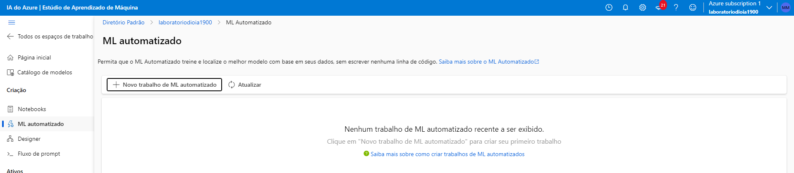
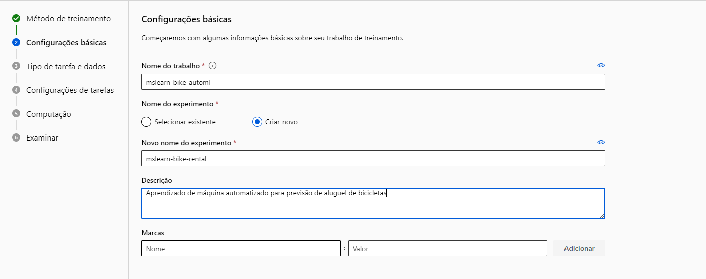

<h1>Machine Learning</h1>
<h3>Criando modelo de previsão</h3>

Para começarmos,precisamos de criar um workspace para conseguirmos criar o trabalho automatizado.

Depois de criado,devemos entrar no ML studio e clicar em "Novo trabalho de ML automatizado".

Realizamos as configurações básicas relacionadas aos nossos interesses.

Ao entrar na etapa "Tipo de tarefa e dados", selecionamos em "Selecionar tipo de tarefa" Regressão e clicamos em "Criar".

Prenchemos os campos e o tipo é "Tabular" e clicamos em avançar.

Escolhemos a opção "De arquivos da Web".

Utilizamos uma fonte de dados da web.

No "Esquema" e "Examinar não mechemos em nada e clicamos em criar".

Clicamos em "Limites" e faremos algumas alterações.

Clicamos em "Exibir definições de configuração adicionais", desmarcamos tudo e selecionamos: 

Depois, avança,os todos os passos  e aguardamos a criação

Após a criação você pode ver as métricas dos testes.

