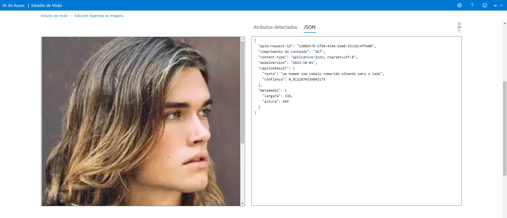
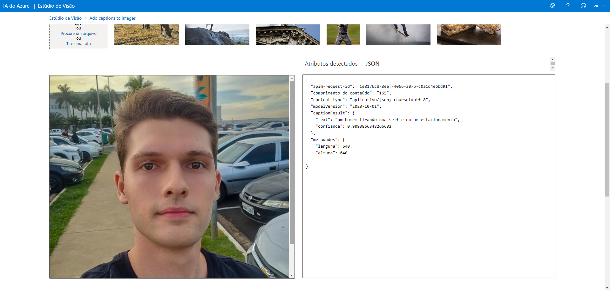

<h1>Optical character recognition (OCR – reconhecimento de caractere óptico) </h1>

 É o processo que irá converter qualquer imagem de texto em um formato de texto legível por máquina. Como exemplo, digitalizar uma nota fiscal, o computador vai salvar a digitalização como um arquivo de imagem.

<h3>Configurando ambiente</h3>

Crie um novo serviço em IA + Machine Learning, depois escolha a opção "Serviços Cognitivos" e faça as suas configurações.

Para começarmos, precisamos acessar o site https://portal.vision.cognitive.azure.com 

Depois clicamos em "View all resources".

Selecionamos um recurso e clicamos em "Select as default resource".

Clicamos em "Image analysis" e escolhemos a opção "Add captions to images" por exemplo.

Deixar marcado o checkbox "I acknowledge that this demo will incur usage to resource".

Escolha uma imagem de sua preferência e, nesse caso, irá te retornar uma descriação da imagem que você enviou.

<h3>Considerações</h3>
<h6>Exemplo 1</h6>

O intuito da escolha dessa imagem é verificar se a IA iria se confundir com uma mulher.
 
Nesse exemplo, podemos observar que a descrição foi bem pontual.
Com uma confiança de 0,81

 
<h6>Exemplo 2</h6>

Nesse exemplo foi bem pontual também, mas o percentual de confiança caiu.

Embora sejam crianças aparentemente, o garoto de chapéu vermelho já é adulto.

Mas, se compararmos com a visão humana e sem termos o contexto, logicamente uma pessoa comum descreveria a foto da mesma maneira que a IA.

 
<h6>Exemplo 3</h6>

Agora como último exemplo, utilizei a minha foto de perfil.

Reparem no detalhe do texto informado e a veracidade com a foto selecionada, que está relacionado com percentual de confiança (que aumentou).

Com uma confiança de 0,90.

<h3>Configurando finais</h3>

Com esse software de IA, podemos descrever fotos, digitalizar imagens, entre várias funcionalidades que podem ser  implementadadas em  sistemas de segurança, além de gerar acessibilidade para pessoas com deficiência na visão (descrevendo a imagem gerada pela IA, por aúdio) por exemplo.
Percebemos que com a utilização da IA, o "Add captions to images", quanto maior for o percentual de confiança, maior será a veracidade  da descrição da foto selecionada.

