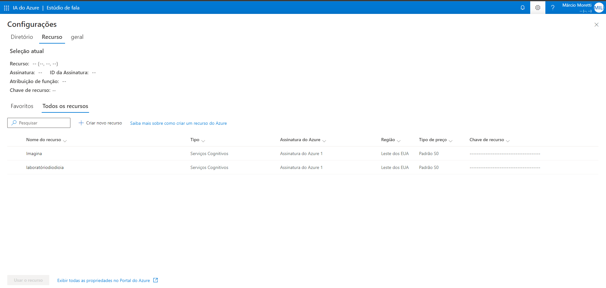
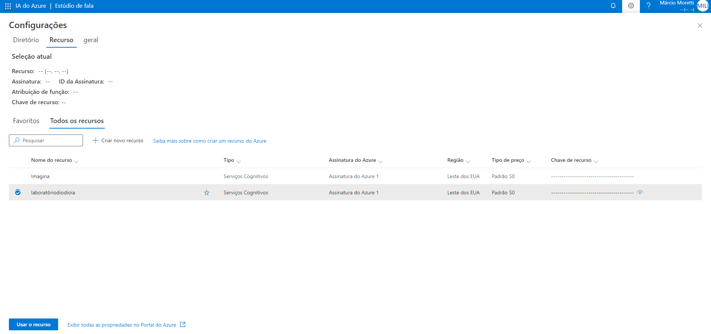
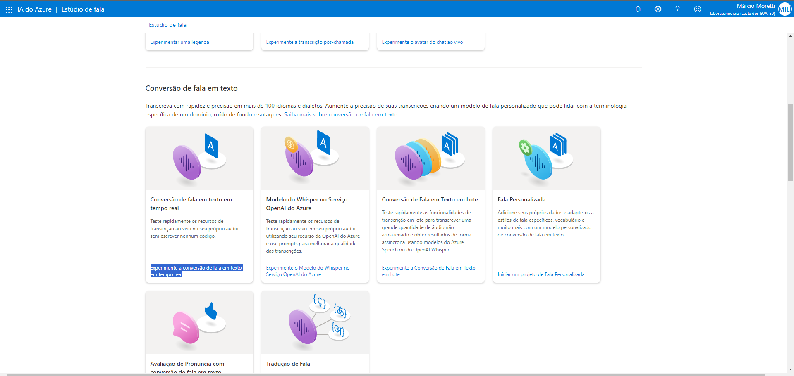
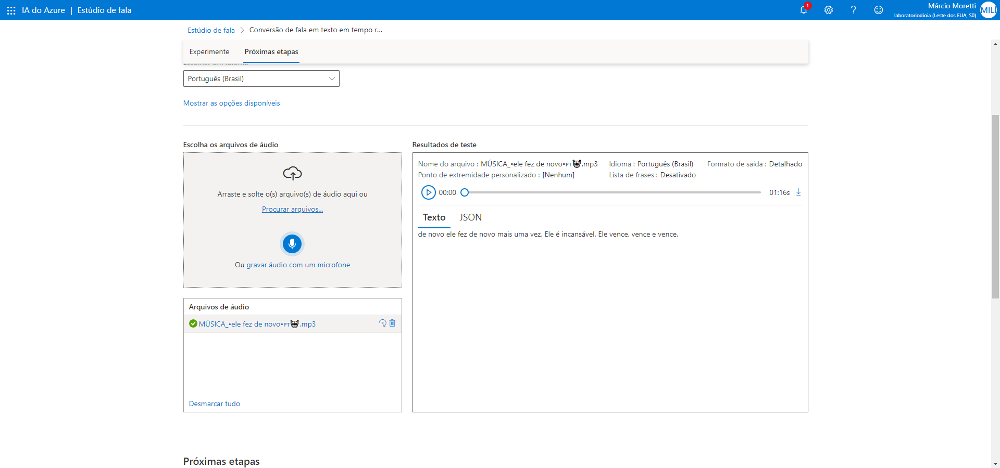
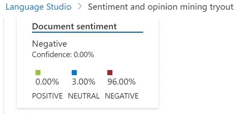

<h1>Conversão de fala em texto em tempo real</h1>

Trancrever o que está sendo falado por um aúdio ou inserir um arquivo de texto e gerar uma voz.

<h3>Configurando o ambiente</h3>

Entre no link https://speech.microsoft.com/portal

Clique no simbolo de configuração e, crie um recuso caso não haja nenhum.

Selecione o recurso e clique em usar o recurso.

<h4>Escolhemos a opção Conversão de fala em texto em tempo real</h4>

Escolhemos a linguagem do aúdio que iremos transcrever e selecionamos o arquivo de aúdio, ele será trancrito em formato de texto.

<h3>Language Studio</h3>

Vai nos trazer dados sobre um texto, se baseando nos sentimentos através de palavras chaves.

Mostrará para nós os percentuais de sentimentos de positividade, negatividade e neutralidade. 

<h3>Considerações Finais</h3>

É de notável importância a "Conversão de fala em texto em tempo real" tanto para gerar acessibilidade para pessoas com deficiências visuais, quanto para gerar legendas de vídeos como por exemplo, não se limitando a apenas isso.

 Também temos a funcionalidade de "Análise de Texto" no Language Studio que nos permitir analisar os sentimentos de um texto digitado. Sendo ideal para análise de feedbacks de uma empresa que precise saber o quão satisfeitos os clientes estão, relacionado a um cenário com mais de 100, um milhão de comentários. 

