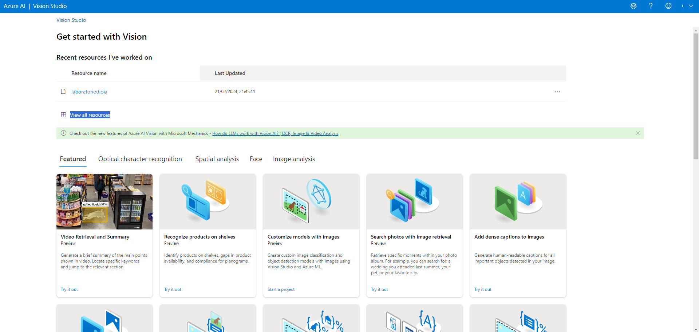
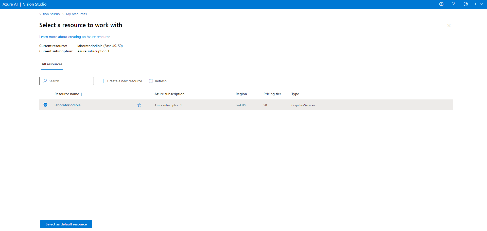
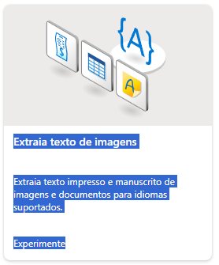
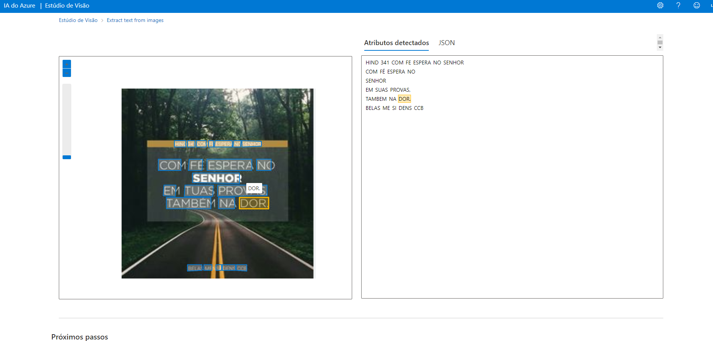

<h1>Explorando os Recursos de IA Generativa</h1>

 O recurso que iremos utilizar será o de Extrair texto de imagens

<h3>Configurando ambiente  e testando</h3>
<ul>
<li>Acesse o site https://portal.vision.cognitive.azure.com</li>
<li>Clique em ver recursos.</li>
<li>Selecione um e clique em "Selecione como recurso padrão".</li>
<li>Caso não tiver nenhum recurso, você terá que criar um novo recurso.</li>

<li>Selecione a opção "Extraia texto de imagens".</li>

<li>Deixe marcado o checkbox "Reconheço que esta demonstração incorrerá no uso de recursos".</li>
<li>Por fim, faça o upload da imagem que deseja, como no exemplo abaixo:</li>

</ul>

<h3>Configurando finais</h3>

O recurso de reconhecimento e extração de textos do Azure oferece às empresas uma maneira eficiente de digitalizar documentos, exigindo apenas a inserção de uma imagem. Por exemplo, isso pode ser utilizado para controlar os gastos dos funcionários, com os recibos das despesas realizadas durante viagens a trabalho. Isso é apenas um exemplo das inúmeras possiblidades que a plataforma do Azure nos oferece.

